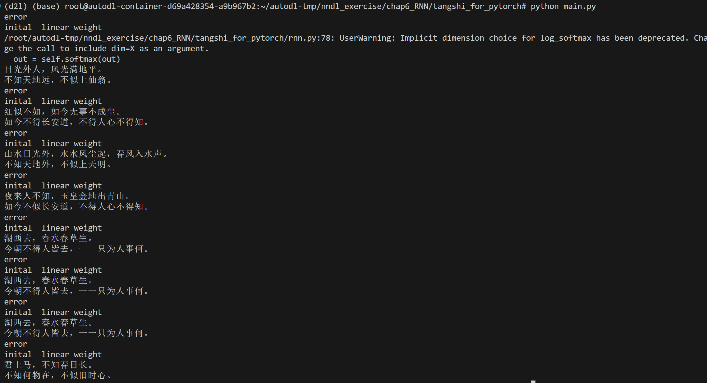
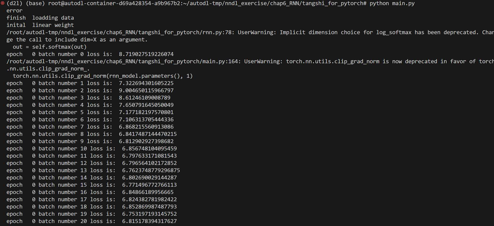

# 解释三种模型

## RNN
有隐状态循环神经网络

$H_t=ϕ(X_tW_{xh}+H_{t−1}W_{hh}+b_h)$

中间部分实际上等价于$[X_t,H_{t-1}][W_{x,h}^T,W_{h,h}^T]^T$

隐状态共享参数的，参数开销不会随着不同的时间步而变化。当前时间步的隐状态会送入下一层和全连接输出层计算当前时间步的输出

## 门控循环单元 GRU

为了解决梯度爆炸问题，我们会采用一些方法进行分离梯度。然而在特定的情况下，早期观测值对预测所有未来的观测值都非常有意义。

因此我们考虑能否让模型自行决定是否保留长期记忆，具体就是决定何时更新隐状态何时重置隐状态，分别对应更新门和重置门

对于(n,d)的输入，(n,h)的输出，重置门R和更新门Z的维度都是(n,h)，是由当前时间步的输入和前一时间步的隐状态对应的全连接层加上sigmoid激活

$R_t=σ(X_tW_{xr}+H_{t−1}W_{hr}+b_r)
\\Z_t=σ(X_tW_{xz}+H_{t−1}W_{hz}+b_z)$

我们将重置门R与常规隐状态更新机制集成，用R与$H_{t-1}$按元素乘积，再代入原更新公式得到候选隐状态，由于R的区间是(0,1)，因此可以减少以往状态的影响。

更新门则决定新的隐状态在旧状态和候选隐状态的权衡，Z与旧隐状态按元素乘，(1-Z)与候选隐状态按元素乘，再两者相加。Z使得早期的隐状态有可能传递到序列结束

## 长短期记忆网络 LSTM

> GRU是LSTM的简洁实现
> 

LSTM中有三个门：输入门I，遗忘门F，输出门O，大小都是(n,h)，也是全连接+sigmoid。还有一个候选记忆单元C，大小也是(n,h)，是全连接层+tanh(范围在-1，1)

输入门控制多少采用候选记忆单元C，遗忘门决定多少采用过去记忆单元$C_{t-1}$，输出门用于计算当前时间步的隐状态

嵌入层 embedding layer

对于文本序列，将每个词元映射为特征向量

引入一个矩阵(vocab_size, embed_size)，通过词元的索引i找到对应的第i行，即为该词元的特征向量

# 歌生成的过程

1. 数据预处理：

读取诗歌文件，去除特殊字符和不符合条件的诗歌。统计每个字的出现频率，构建字典将字映射到整数索引。将诗歌转换为整数索引的列表。

2. 生成批次数据：

将诗歌数据分成多个批次，每个批次包含多个诗歌。对于每个批次，生成输入和输出数据，输出数据是输入数据右移一位。

3. 模型训练：

初始化词嵌入层和RNN模型。使用RMSprop优化器和负对数似然损失函数进行训练。
在每个epoch和batch中，计算损失并更新模型参数。定期保存训练好的模型。

4. 诗歌生成：

加载训练好的模型。从给定的开始字开始，逐步生成下一个字。将生成的整数索引转换为对应的汉字。当生成结束标记或达到最大长度时停止生成。

# 生成诗歌截图

训练截图

# 总结

模型对比：

1. RNN 模型能够捕获序列数据的时间依赖性，但容易出现梯度消失或梯度爆炸问题，限制了其对长序列的建模能力。GRU 和 LSTM 通过引入门控机制有效缓解了梯度问题。GRU 结构较为简单，适合资源受限的场景，而 LSTM 提供了更强的灵活性和记忆能力。

2. 通过嵌入层将离散的词元映射为连续的特征向量，降低了输入的维度，同时保留了词语之间的语义关系。

3. 首先对诗歌数据进行预处理，生成词汇表和批次数据。然后初始化词嵌入层和 RNN 模型，使用 RMSprop 优化器和负对数似然损失函数。模型通过多轮迭代训练，每个批次计算损失并反向传播更新参数，同时定期保存模型。

4. 通过加载训练好的模型，从给定的起始字开始逐步生成诗歌，体现了序列生成模型的实际应用能力。

5. 生成的诗歌能够基本符合语法和语义规则，展示了模型对中文诗歌风格的学习能力。
不同模型在生成质量和训练效率上各有优劣，需根据具体需求选择合适的模型。